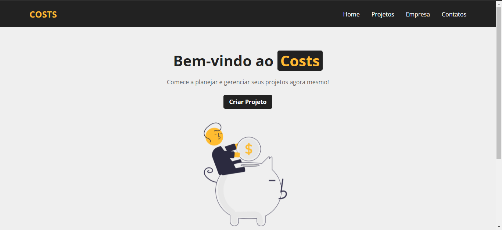
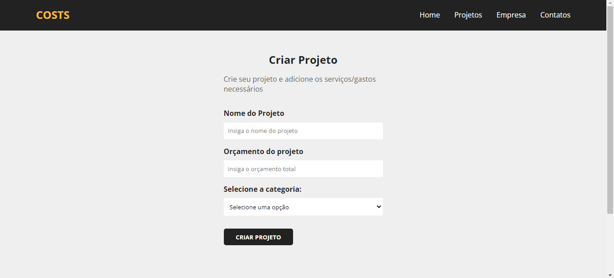
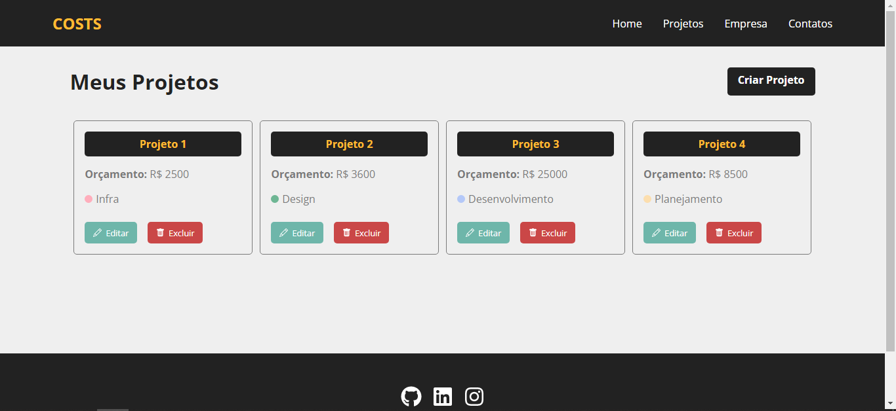
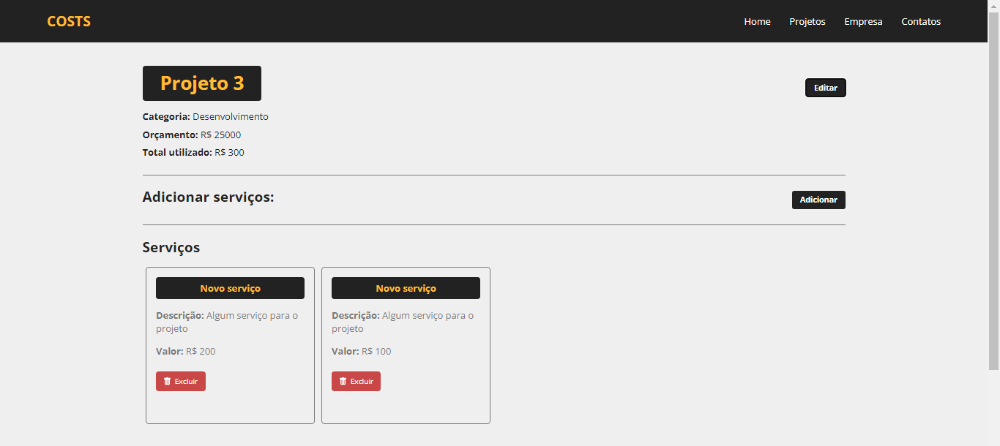

<h1 align="center"> 📊COSTS</h1>
<h3 align="center">planejamento e gerenciamento de projetos</h3>
</br>

### 📸 Screenshots da Aplicação:
<div>
  
  
</div>

<div>
  
  
</div> </br>

</br>
<p align="center">
  <a href="linkedin.com/in/wesley-emanuel-alves-de-oliveira-7b05781b9">Linkedin</a>&nbsp;&nbsp;&nbsp;|&nbsp;&nbsp;&nbsp;
  <a>Email: dev.wesleyalves@gmail.com</a>
</p> </br>

### 📝 Sobre o projeto:
Site para planejar e gerenciar projetos, adicionando, removendo e editando a
descrição, os serviços, e orçamento.
O site foi todo desenvolvido em ReactJs. Além do uso dos components e hooks, 
simulei o banco de dados com uma api em Json, utilizando o fetch pra fazer as requisições.
O projeto foi feito junto ao curso de ReactJs do canal Hora de codar (no Youtube). Foi uma
ótima experiência e oportunidade de colocar os conhecimentos em prática, além aprender ainda mais.

### ⚛ Tecnologias utilizadas:
- ReactJs
- Javascript
- CSS
- JSON Server

### 🏃🏻‍♂️ Como executar o Projeto

#### 🔧 Instalando as Dependências
```bash
npm install
```

🗃 Para executar o servidor Json:
```bash
npm run backend
```

🌎 Para executar a aplicação React:
```bash
npm start
```

</br>
<p align="center">
  <a href="linkedin.com/in/wesley-emanuel-alves-de-oliveira-7b05781b9">Linkedin</a>&nbsp;&nbsp;&nbsp;|&nbsp;&nbsp;&nbsp;
  <a>Email: dev.wesleyalves@gmail.com</a>
</p>
